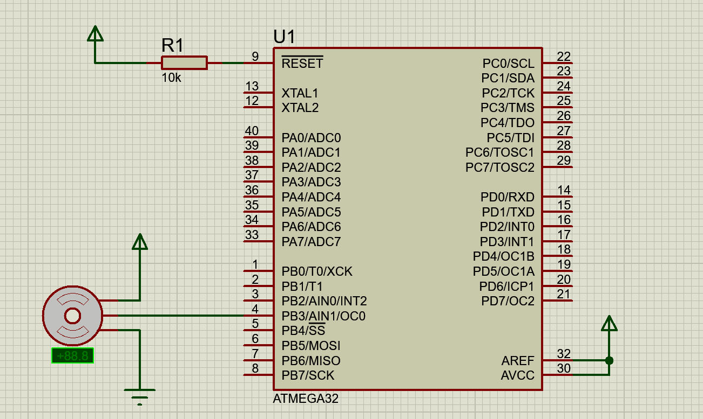

<!-- PROJECT TITLE -->
<h1 align="center">"Servo Motor Interfacing With PWM In ATmega32"</h1>

<!-- OVERVIEW -->
## <br>**➲ Overview**
This project is designed to control a servo motor using pulse-width modulation (PWM) with an ATmega32 microcontroller. The project aims to demonstrate precise control of a servo motor's position by generating PWM signals with varying duty cycles. This setup allows the servo motor to move to different angles according to the duty cycle applied, achieving accurate positioning.

<!-- HARDWARE REQUIREMENTS -->
## <br>**➲ Hardware Requirements**
* IMTSchool Development Kit (or a compatible hardware setup)
* USBASP Programmer (or another suitable programmer)
* Jumper wires

<!-- SOFTWARE REQUIREMENTS -->
## <br>**➲ Software Requirements**
* <a href="https://www.eclipse.org/downloads/packages/release/2023-06/r/eclipse-ide-cc-developers" target="_blank">Eclipse IDE</a> 
* <a href="https://www.labcenter.com/downloads/" target="_blank">Proteus</a> 
* <a href="https://sourceforge.net/projects/winavr/" target="_blank">WinAVR</a> 
* <a href="https://www.fischl.de/usbasp/" target="_blank">USBASP driver</a> 

**NOTE:** you can install another simulation program like multisim and another IDE like Microship studio or VS code with external compiler, anything can work all you need is to compile the project to generate hex file.

<!-- PROJECT STRUCTURE -->
## <br>**➲ Project Structure**
The project is structured as follows:
* main.c: The main application code responsible for counting and controlling the LEDs based on the 7-segment display's value.
* STD_TYPES.h: A header file containing standard data types for the project.
* BIT_MATH.h: A header file containing bit manipulation macros.
* DIO Driver:
  * DIO_Program.c: The source code for the DIO driver functions.
  * DIO_Interface.h: The interface (header) file for the DIO driver.
  * DIO_Register.h: Registers addresses for the DIO driver.
* TIMER Driver:
  * TIMER_Program.c: Implementation of the TIMER driver.
  * TIMER_Interface.h: Interface for the TIMER driver.
  * TIMER_Register.h: Registers addresses for the TIMER driver.
  * TIMER_Config.h: Configuration file for TIMER settings.

<!-- GETTING STARTED -->
## <br>**➲ Getting Started**
1. **Hardware Setup:**
   * Connect servo motor to portb pin3 (OC0) of ATmega32 microcontroller.

2. **Software Setup:**
* Install Eclipse on your computer.
* Set up Proteus for simulation.
* Install the USBASP Programmer software and ensure your programmer is connected.
1. **Clone the Repository:**
```sh
git clone https://github.com/omaarelsherif/Servo-Motor-Interfacing-With-PWM-In-ATmega32.git
```
1. **Build the project:**
   * Build the project using Eclipse or any another IDE
   * Use the USBASP Programmer to flash the ATmega32 with the generated hex file.
2. Run the Simulation:
   * If you want to simulate the project, open it in Proteus and run the simulation.
3. Observe the motor:
   * The motor will turn to 35 angle then 90 angle.

<!-- OUTPUT -->
## <br>**➲ Output**
<h4>Simulation Design: </h4>
In this gif, you can see the simulation setup in Proteus. The sevro motor connected to port B pin3 and of the ATmega32 microcontroller and When project run the pwm will send 3 different values to make motor run with different angles.



<h4>Hardware Connection (IMTSchool Kit): </h4>
This gif showcases the physical hardware connection using the IMTSchool Development Kit. The ATmega32 microcontroller is connected to sevro motor, mirroring the simulation design.


<!-- CONTACT -->
## <br>**➲ Contact**
- E-mail   : [omaarelsherif@gmail.com](mailto:omaarelsherif@gmail.com)
- LinkedIn : https://www.linkedin.com/in/omaarelsherif/
- Facebook : https://www.facebook.com/omaarelshereif
